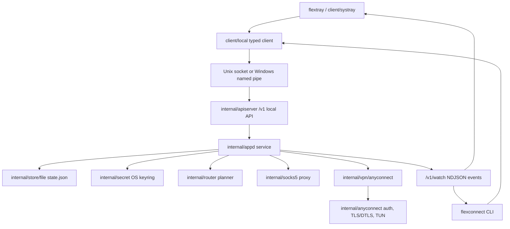

# Project Overview
FlexConnect is a Go-based, cross-platform AnyConnect client modeled after the
Tailscale client shape: a privileged local daemon owns VPN state, while a CLI,
desktop tray, typed local API client, and browser console provide user control.
Its pitch is a single local control plane for profiles, routing, diagnostics,
SOCKS5 proxying, and real AnyConnect password-auth sessions.

## Repository Structure
- `assets/` contains application icons and Windows runtime assets.
  - `icons/` embeds tray, favicon, and logo assets into Go binaries.
  - `windows/` holds Windows-specific assets such as the tray icon and Wintun DLL.
- `client/` contains user-facing clients for the daemon.
  - `local/` is the typed HTTP-over-local-IPC API client.
  - `systray/` builds the desktop tray menu and daemon event watcher.
- `cmd/` contains Go command entry points.
  - `flexconnect/` is the CLI.
  - `flexconnectd/` is the daemon.
  - `flextray/` is the tray process.
  - `dist/` builds release artifacts across Linux, Windows, and macOS.
- `dist/` is generated packaging output and should not be treated as source.
- `docs/` contains project audit and acceptance notes.
- `internal/` contains daemon, API, VPN, routing, IPC, storage, logging, and type code.
  - `anyconnect/` is the embedded AnyConnect protocol, tunnel, TUN, and auth stack.
  - `apiserver/` exposes the local `/v1` control API.
  - `appd/` owns profiles, connection state, notifications, local UI, and proxy state.
  - `ipc/` abstracts Unix sockets and Windows named pipes.
  - `router/` plans effective routes from server routes and profile overrides.
  - `secret/` stores passwords through the OS keyring or an in-memory test store.
  - `store/file/` persists non-secret profile state as JSON.
  - `vpn/` defines the backend interface and the AnyConnect adapter.
- `release/` contains packaging metadata, lifecycle scripts, and release target assets.
- `scripts/` contains build, packaging, install, smoke-test, and live-test scripts.
  - `launchd/` contains the macOS daemon plist.
  - `systemd/` contains the Linux daemon service unit.
- `tmp/` is local temporary output and should not be treated as source.
- `.env` is a local live-test secrets file and is ignored by Git.
- `.gitignore` defines ignored secrets, build outputs, runtime state, and caches.
- `go.mod` and `go.sum` define the Go module and locked dependencies.
- `README.md` is the primary user-facing quick start and validation guide.

## Build & Development Commands
Install or refresh Go modules:

```powershell
go mod download
```

Run the daemon and tray during development:

```powershell
go run .\cmd\flexconnectd
go run .\cmd\flextray
```

Run the CLI from source:

```powershell
go run .\cmd\flexconnect status
go run .\cmd\flexconnect login
go run .\cmd\flexconnect web
```

Build all Go packages:

```powershell
go build ./...
```

Build distribution artifacts through the unified dist entrypoint:

```powershell
go run .\cmd\dist list
go run .\cmd\dist build --version 1.0.0 linux/amd64/tgz
go run .\cmd\dist build --version 1.0.0 linux/amd64/deb
go run .\cmd\dist build --version 1.0.0 linux/amd64/rpm
go run .\cmd\dist build --version 1.0.0 windows/amd64/zip
go run .\cmd\dist build --version 1.0.0 windows/amd64/msi
go run .\cmd\dist build --version 1.0.0 darwin/amd64/pkg
go run .\cmd\dist build --version 1.0.0 darwin/arm64/pkg
```

Install or remove the Windows service:

```powershell
.\scripts\install-windows-service.ps1
.\scripts\uninstall-windows-service.ps1
```

Install Linux or macOS service templates after building binaries into `bin/`:

```bash
./scripts/install-linux.sh
./scripts/install-macos.sh
```

Run unit and integration tests:

```powershell
go test ./...
```

Run local control-plane smoke tests:

```powershell
.\scripts\smoke-test.ps1
```

```bash
./scripts/smoke-test.sh
```

Run the live AnyConnect acceptance test with a local `.env` file:

```powershell
.\scripts\live-connect-test.ps1 -EnvFile .env
```

Format only touched Go files:

```powershell
gofmt -w .\path\to\touched_file.go
```

Lint:

> TODO: Add a repository-owned lint command and config. `go vet ./...` currently
> reports an existing unkeyed Windows GUID literal in `internal/anyconnect/tun`.

Type-check:

```powershell
go test ./...
```

Debug daemon and CLI calls with verbose logging:

```powershell
go run .\cmd\flexconnectd -v
go run .\cmd\flexconnect -v status
```

Deploy:

> TODO: Add production deployment documentation. Today, deployment is represented
> by the packaging and service-install scripts above.

## Code Style & Conventions
- Use Go 1.26.2 as declared in `go.mod`.
- Run `gofmt` on touched Go files; avoid repo-wide formatting churn unless requested.
- Keep package names lower-case and aligned with their directories.
- Put command entry points in `cmd/<binary>` and reusable code in `client/` or `internal/`.
- Use `UpperCamelCase` for exported Go identifiers and `lowerCamelCase` for unexported ones.
- Keep JSON field names in `snake_case` to match `internal/types`.
- Prefer typed structs in `internal/types` over ad hoc maps for local API payloads.
- Pass `context.Context` through daemon, client, backend, and long-running operations.
- Store non-secret profile metadata through `internal/store/file`; store passwords only through
  `internal/secret`.
- Use fake VPN backends, memory secret stores, and temp state paths in tests.
- Existing logging is component-based through `internal/logging`; keep new logs concise and
  avoid passwords, tokens, and full credential-bearing URLs.
- No repo-owned `golangci-lint`, Staticcheck, Makefile, Taskfile, or CI lint config was found.
- Commit-message template:

> TODO: Add the repository's commit-message convention before enforcing one.

## Architecture Notes


The daemon `flexconnectd` listens on a platform-specific local IPC endpoint and serves the
`internal/apiserver` HTTP API over that socket or named pipe. The CLI and tray both use
`client/local`, so control commands, profile edits, status reads, diagnostics, and event watches
share one typed client path. `internal/appd` is the stateful coordinator: it loads and persists
profiles, stores password references in the OS keyring, starts and stops the VPN backend, computes
effective routes, manages the optional SOCKS5 listener, serves the local browser console, and emits
watch notifications. The AnyConnect adapter configures the embedded protocol stack, performs
password auth, establishes TLS/DTLS and TUN state, then reports session details back to the daemon.

## Testing Strategy
- Unit tests cover routing, logging, file storage, CLI behavior, tray helpers, and the AnyConnect
  backend adapter.
- Integration tests in `internal/apiserver` and `internal/appd` exercise the local API, daemon
  state transitions, diagnostics, profile CRUD, route replay, and fake backend events.
- The live test in `internal/liveenv` is skipped unless `FLEXCONNECT_RUN_LIVE=1` is set by
  `scripts/live-connect-test.ps1`.
- Smoke tests start a real daemon with an isolated socket and state file, then run CLI status,
  profile list, diagnostics, and disconnect commands.
- Local default:

```powershell
go test ./...
```

- Windows smoke:

```powershell
.\scripts\smoke-test.ps1
```

- Linux/macOS smoke:

```bash
./scripts/smoke-test.sh
```

- Live AnyConnect acceptance, only with explicit credentials in `.env`:

```powershell
.\scripts\live-connect-test.ps1 -EnvFile .env
```

> TODO: No CI workflow was found. Add CI that runs `go test ./...`, an OS-appropriate
> smoke test, packaging checks, and dependency scanning.

## Security & Compliance
- `.env`, `.env.*`, generated diagnostics, state files, logs, binaries, installers, and temp
  outputs are ignored by `.gitignore`; do not commit them.
- Passwords are stored through `internal/secret` using the OS keyring in production and a memory
  store in tests.
- Profile state persists only metadata and `secret_ref` values, not raw passwords.
- Diagnostics are tested to avoid raw password leakage; keep that invariant for new fields.
- Local control traffic is served over Unix sockets or Windows named pipes, not a public TCP port.
- Windows daemon startup may request elevation; service install scripts modify system services.
- Live tests use real AnyConnect credentials and may alter local VPN, route, DNS, and TUN state.
- Dependency scanning is not configured in the repository.

> TODO: Add a dependency-vulnerability workflow such as `govulncheck` and document the expected
> remediation process.

- `cmd/dist` marks Linux package metadata as `Proprietary`; no root `LICENSE` file was found.

> TODO: Add or link the authoritative project license before external distribution.

## Agent Guardrails
- Do not read, print, commit, or modify `.env`, `.env.*`, generated diagnostics, or user state
  files unless the user explicitly asks.
- Do not edit generated outputs under `bin/`, `dist/`, `tmp/`, installer artifacts, or compiled
  binaries except as part of an explicit packaging task.
- Do not replace `assets/windows/wintun.dll` without a reviewed upstream provenance note.
- Do not run service install or uninstall scripts without explicit user approval; they require
  administrator or root privileges and modify host services.
- Do not run live AnyConnect tests unless the user explicitly requests them and provides or confirms
  a valid local `.env`.
- Changes to auth, secret storage, diagnostics, routing, TUN, service scripts, installers, and
  package metadata require human review.
- Keep new daemon, tray, and CLI operations bounded with contexts or cancellation paths.
- Prefer `/v1/watch` for UI updates instead of adding tight polling loops.
- Only change `go.mod` or `go.sum` when intentionally adding, removing, or upgrading dependencies.
- Preserve existing build and packaging commands unless the user asks to change them.
- If adding nested `AGENTS.md` files, make their scope explicit and keep overrides narrower than
  this root guide.

> TODO: Define formal retry, polling, and rate-limit policy for new clients and background loops.

## Extensibility Hooks
- Add VPN providers by implementing `internal/vpn.Backend` and wiring the backend in
  `cmd/flexconnectd/newService`.
- Customize route behavior by implementing `internal/router.Planner` and injecting it into
  `appd.New`.
- Swap state persistence by implementing the `appd.Store` interface used by `internal/appd`.
- Swap secret persistence by implementing `internal/secret.Store`.
- Extend the local API by updating `internal/types`, `internal/apiserver`, `client/local`, and then
  the CLI or tray callers.
- Add CLI commands under `cmd/flexconnect` and keep help text in sync with behavior.
- Add tray behavior in `client/systray`, using existing status, diagnostics, and watch flows.
- Add package formats or install behavior through `cmd/dist`, `release/dist`, `scripts/`, and `release/`.
- Useful flags and environment variables:
  - `--socket` selects the daemon socket or named pipe for daemon, CLI, and tray.
  - `--state` selects the daemon state file.
  - `-v` and `--verbose` enable debug logging for daemon and CLI.
  - `FLEXCONNECTD_NO_ELEVATE=1` disables Windows daemon auto-elevation.
  - `FLEXCONNECT_RUN_LIVE=1` enables the live AnyConnect test.
  - `FLEXCONNECT_ENV_FILE` points the live test at an env file.
  - `FLEXCONNECT_LIVE_ELEVATED` is used by the live-test elevation wrapper.
  - `SOCKET_PATH` and `STATE_PATH` customize Unix smoke-test paths.
  - `--version` and `--out` customize `cmd/dist build` output.
  - `SYSTEMD_DIR` and `PLIST_TARGET` customize install locations.

> TODO: No feature-flag system was found. Add one before introducing runtime feature toggles.

## Further Reading
- [README.md](README.md)
- [docs/completion-audit.md](docs/completion-audit.md)
- [assets/icons/README.md](assets/icons/README.md)
- [scripts/systemd/flexconnectd.service](scripts/systemd/flexconnectd.service)
- [launchd plist](scripts/launchd/com.flexconnect.flexconnectd.plist)

> TODO: Add deeper architecture docs such as `docs/ARCH.md` and ADRs when design decisions need
> durable explanation.
